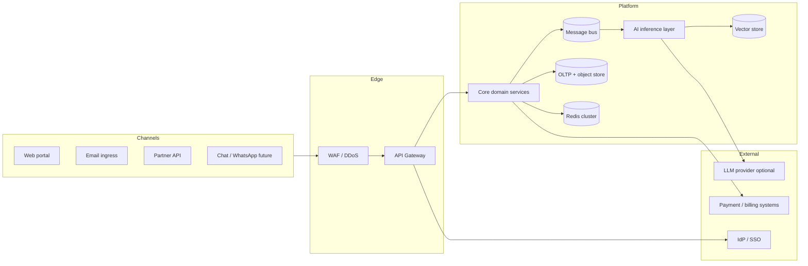
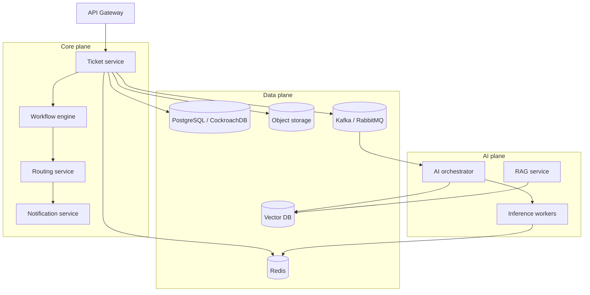
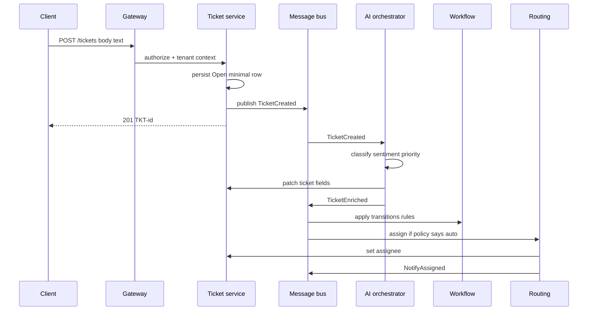
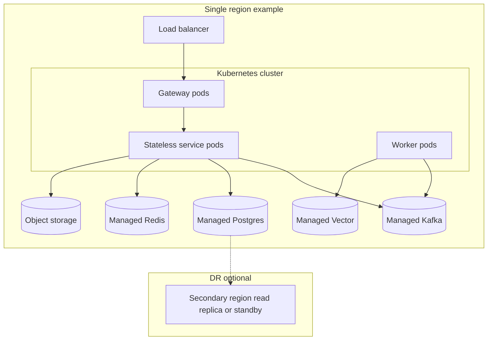

# Scalable System Design

**AI-Powered Customer Complaint & Support Platform**

This document describes a production-oriented, horizontally scalable architecture aligned with the product vision in the repository README. It is technology-agnostic where possible, with concrete choices called out as examples.

## Diagram Reference

- Visual system diagram (PNG): [`system-design-diagram.png`](./system-design-diagram.png)
- Diagram document (PNG + Mermaid): [`SYSTEM_DESIGN_DIAGRAM.md`](./SYSTEM_DESIGN_DIAGRAM.md)

---

## 1. Design goals

| Goal | Implication |
|------|-------------|
| **Multi-tenant isolation** | Every request carries tenant context; data is partitioned or filtered by `tenant_id`; optional dedicated resources for enterprise tiers. |
| **Horizontal scale** | Stateless APIs; work pushed to queues; databases and caches that shard or replicate. |
| **Low latency for humans** | Ticket creation ACKs quickly; heavy AI work is asynchronous with progress notifications. |
| **Reliability** | Idempotent consumers, dead-letter queues, retries with backoff, clear SLAs per stage. |
| **Observability** | Distributed tracing, metrics, structured logs with `tenant_id`, `ticket_id`, `correlation_id`. |
| **Safe AI rollout** | Model versioning, shadow traffic, feature flags, human-in-the-loop for sensitive actions. |

---

## 2. System context (who talks to what)

---

## 3. Container architecture (major deployable units)

These map to Kubernetes deployments (or equivalent) and scale independently.

| Service | Responsibility | Scale trigger |
|---------|----------------|---------------|
| **API Gateway** | Authn/Z, rate limits, routing, request size limits, API keys for partners | RPS, TLS termination CPU |
| **Auth / Identity** | JWT issuance, refresh, RBAC claims, SSO/OIDC federation | Auth RPS |
| **Ticket service** | Ticket CRUD, lifecycle, attachments metadata, tenant scoping | Ticket read/write volume |
| **Ingestion adapters** | Email polling/webhooks, partner webhooks; normalize to internal event | Inbound channel volume |
| **Workflow engine** | State machine (Open → … → Closed), guards, side effects | State transition rate |
| **AI orchestrator** | Chains classification, sentiment, priority; fans out to workers; persists artifacts | Queue depth, AI SLA |
| **Inference workers** | Embedding, classification, sentiment, priority models (GPU optional) | GPU/CPU queue lag |
| **Routing / assignment** | Skills, load, SLA-aware assignment; idempotent claim | Assignment decisions/sec |
| **Notification service** | Email, push, in-app; templates per tenant | Notification throughput |
| **RAG / agent assistant** | Retrieve similar tickets + KB, draft replies (with audit) | Agent UI concurrency |
| **Search / analytics** | Full-text ticket search, operational dashboards (can be CQRS read model) | Query load |
| **Admin / tenant config** | Per-tenant workflow JSON, SLA rules, model version pins | Low relative load |

---

## 4. Core data flows

### 4.1 Ticket creation (fast ACK + async enrichment)

**Principle:** The client receives a ticket identifier quickly; classification, sentiment, priority, and routing complete asynchronously so spikes do not block the HTTP path.

**Idempotency:** Ingestion adapters and gateway must support idempotency keys (email `Message-Id`, partner `X-Idempotency-Key`) so retries never duplicate tickets.

### 4.2 Agent assistant (RAG)

1. Embed current ticket + last N messages (with PII redaction policy per tenant).
2. Query vector store scoped by `tenant_id` (and optionally product line).
3. Retrieve top-k similar resolved tickets and KB chunks.
4. LLM generates draft; store draft version, model id, and retrieved chunk ids for audit.

---

## 5. Multi-tenancy strategy

| Tier | Pattern | Notes |
|------|---------|--------|
| **Default** | Shared app, shared DB, **row-level** `tenant_id` on all tenant-owned tables | Simplest; strict query middleware so no cross-tenant reads. |
| **Growth** | Shared DB, **schema per tenant** or partition by tenant | Easier bulk export per customer; more ops overhead. |
| **Enterprise** | Dedicated DB or cluster | Strong isolation; higher cost; same codebase, different connection targets from tenant registry. |

**Caching:** Redis keys must be namespaced: `tenant:{id}:...`. Never use a bare ticket id as the only key component.

**Search / vectors:** Collections or indexes partitioned by tenant (or tenant metadata filter on every query) to avoid data leakage and to keep indices smaller per query.

---

## 6. Messaging and async processing

- **Broker:** Kafka for high throughput and replay; RabbitMQ is acceptable for moderate scale with clear queue boundaries.
- **Topics / queues (examples):** `ticket.created`, `ticket.enriched`, `ticket.routing.request`, `notification.send`, `analytics.event`.
- **Consumers:** Horizontally scaled worker pools per topic; **consumer groups** for parallelism.
- **DLQ:** Dead-letter topics for poison messages; alerting on DLQ growth.
- **Outbox pattern:** Ticket service writes domain row + outbox row in one DB transaction; relay publishes to bus—avoids dual-write inconsistency.

---

## 7. Storage layout

| Store | Use | Scaling pattern |
|-------|-----|-----------------|
| **OLTP (e.g. Postgres)** | Users, tickets, assignments, audit log, outbox | Read replicas for reporting reads; connection pooling (PgBouncer); later partitioning by `tenant_id` or time |
| **Redis** | Sessions, rate limits, assignment locks, hot ticket cache | Cluster mode; hash tags per tenant for locality if needed |
| **Object storage** | Attachments, large exports | Unlimited scale; lifecycle rules |
| **Vector DB** | Embeddings for tickets + KB | Sharding by tenant or shard key; HNSW or equivalent; replicate read-heavy clusters |
| **Warehouse / lake** | Long-term analytics, model training extracts | Batch ETL from OLTP or change streams |

---

## 8. AI / ML scalability

- **Serving:** Dedicated inference deployments (CPU for small models, GPU pools for LLMs); **autoscale on queue lag** and p95 latency.
- **Batch path:** Nightly or hourly re-embedding for backfill and model upgrades.
- **Model registry:** Version every artifact; pin per tenant in config service.
- **Caching:** Cache classification/priority for **semantic duplicates** (hash of normalized text + tenant + category version).
- **Guardrails:** PII scrubbing before external LLM calls where required; block auto-send of agent drafts without explicit human approval (configurable).

---

## 9. Workflow engine

- **Definition:** Workflow as data (JSON/YAML) per tenant, validated at publish time.
- **Execution:** Deterministic state machine service; transitions triggered only by events from the bus or authorized APIs.
- **Audit:** Append-only history table: `ticket_id`, `from_state`, `to_state`, `actor`, `reason`, `timestamp`.

---

## 10. Security and compliance (architecture hooks)

- **Gateway:** JWT validation, mTLS for service-to-service where applicable.
- **RBAC:** Claims for role + tenant; **policy engine** (OPA/Cedar) for fine-grained checks on sensitive actions.
- **Secrets:** Vault or cloud secret manager; no secrets in images.
- **Encryption:** TLS in transit; disk encryption at rest for DB and object store.
- **Data residency:** Route enterprise tenants to region-pinned stacks (separate K8s cluster or namespace + data plane in region).

---

## 11. Observability and operations

- **Tracing:** OpenTelemetry from gateway through services to DB and message publish/consume.
- **Metrics:** RED/USE per service; business metrics (tickets opened/resolved per tenant, AI latency histograms).
- **Logging:** JSON logs; never log raw secrets; mask PII per policy.
- **SLOs (examples):** Ticket create API p99 under 300 ms; enriched state within N minutes with alerting on breach.

---

## 12. Deployment topology (example)

- **Blue/green or canary** for gateway and stateless services.
- **DB migrations:** Backward-compatible expand/contract migrations to avoid coordinated downtime.

---

## 13. Capacity and scaling checklist

- Stateless services behind LB; **no sticky sessions** except where unavoidable (websocket gateway).
- **Connection limits:** Pool sizing per pod × max replicas ≤ DB max connections.
- **Backpressure:** Queue consumers respect max concurrency; gateway rate limits per tenant and per API key.
- **Hot tenants:** Fair queuing or dedicated partitions for noisy neighbors.
- **Read scaling:** CQRS read models or replicas for agent search and dashboards.

---

## 14. Phased rollout (recommended)

| Phase | Scope |
|-------|--------|
| **MVP** | Monolith or small set of services + single Postgres + Redis + one bus; async AI worker; simple RBAC + `tenant_id`. |
| **Scale-out** | Split ticket/workflow/notification; introduce outbox; read replicas; vector DB. |
| **Enterprise** | SSO, per-tenant workflow, regional stacks, advanced routing and feature store for ML. |

---

## 15. Summary

The design centers on **fast synchronous ticket acceptance**, **asynchronous AI and routing pipelines** on a **durable message bus**, **strict tenant isolation** in data and cache, **independently scalable** inference and RAG services, and **observable** end-to-end flows. That combination matches the product story (Rahim → ticket → AI → Sara → resolution) while remaining operable at growing tenant and ticket volume.
