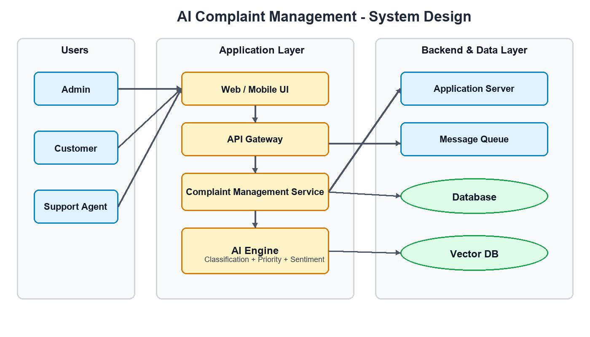
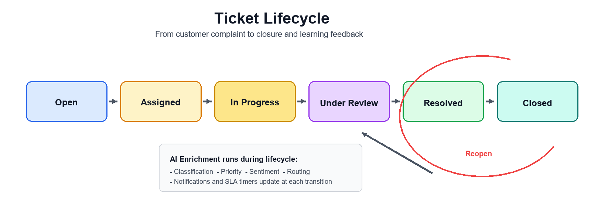
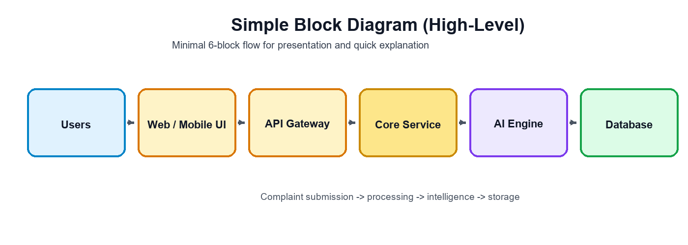

# System Design Diagram

This is the consolidated architecture diagram for the AI-powered complaint management platform.

## Visual Diagram (PNG)

If Mermaid preview is disabled, use this direct image file: [`system-design-diagram.png`](./system-design-diagram.png)

---

## Ticket Lifecycle (PNG)

Direct file link: [`ticket-lifecycle.png`](./ticket-lifecycle.png)

Lifecycle states:

`Open` -> `Assigned` -> `In Progress` -> `Under Review` -> `Resolved` -> `Closed`  
Reopen path: `Closed` -> `In Progress`

---

## Block Diagram (PNG)

Direct file link: [`block-diagram.png`](./block-diagram.png)

---

## Diagram Usage Guide

Use these files based on audience:

- `block-diagram.png` -> high-level presentation (simple 6-block flow)
- `system-design-diagram.png` -> full architecture discussion (detailed components)
- `ticket-lifecycle.png` -> process walkthrough (state transitions + reopen path)

If you want Mermaid source versions, they are documented in `docs/SCALABLE_SYSTEM_DESIGN.md`.

